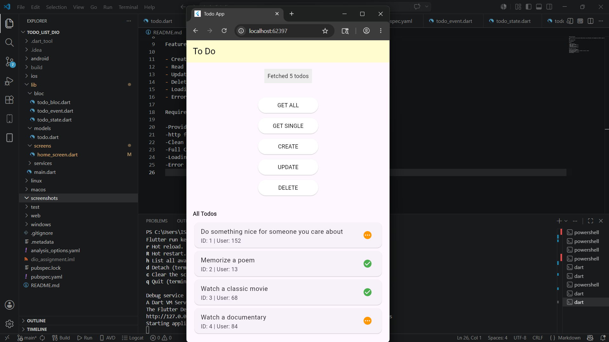
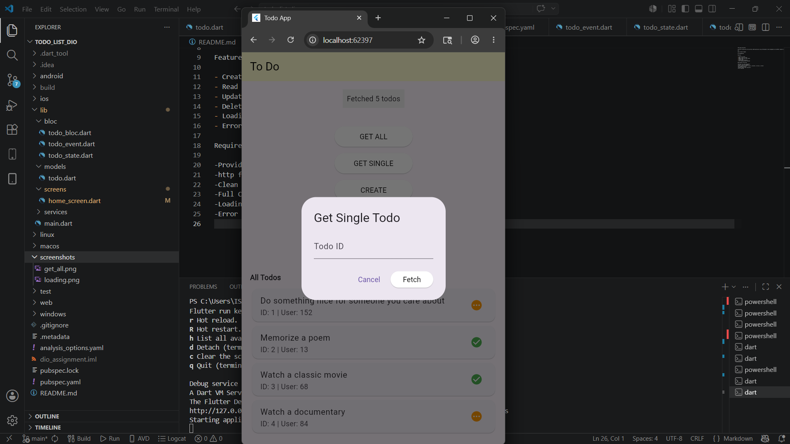
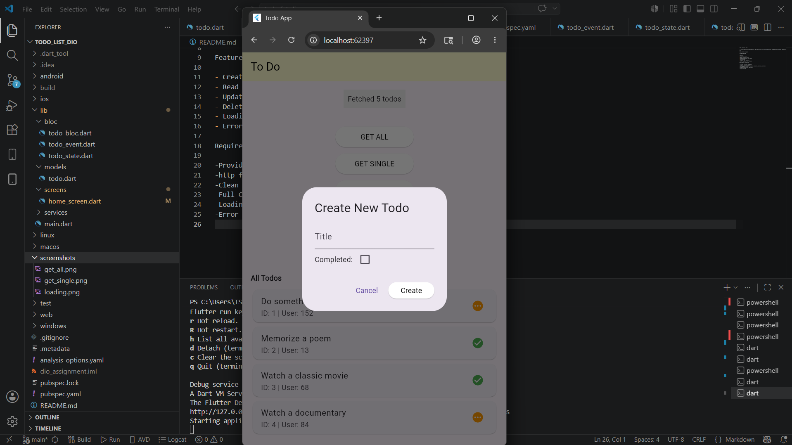
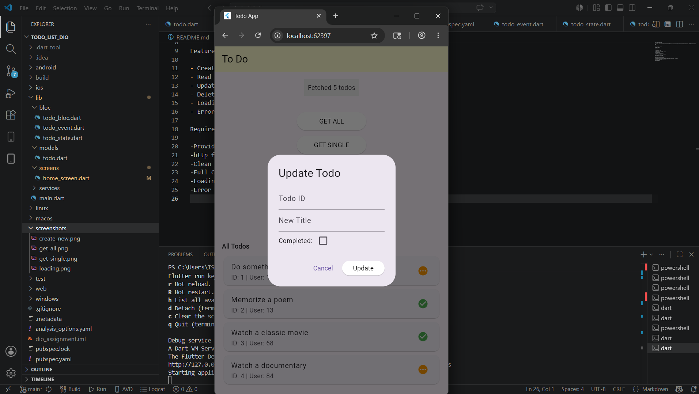

Todo_app_using_http

-A Flutter application that performs CRUD operations using **Provider** state management and **HTTP** requests with the DummyJSON API.

Name= Yeshak Tsegaye

ID= UGR/0585/16

Features

- Create new todos
- Read / view all todos
- Update todo title and status
- Delete todos
- Loading text indicator
- Error handling with messages

 Screenshots

GET ALL

GET SINGLE

CREATE

UPDATE

DELETE

Loading

Requirements Fulfilled

-Provider for state management  
-http for network requests  
-Clean project structure (models, providers, services, screens)  
-Full CRUD operations  
-Loading states (text indicator)  
-Error handling
